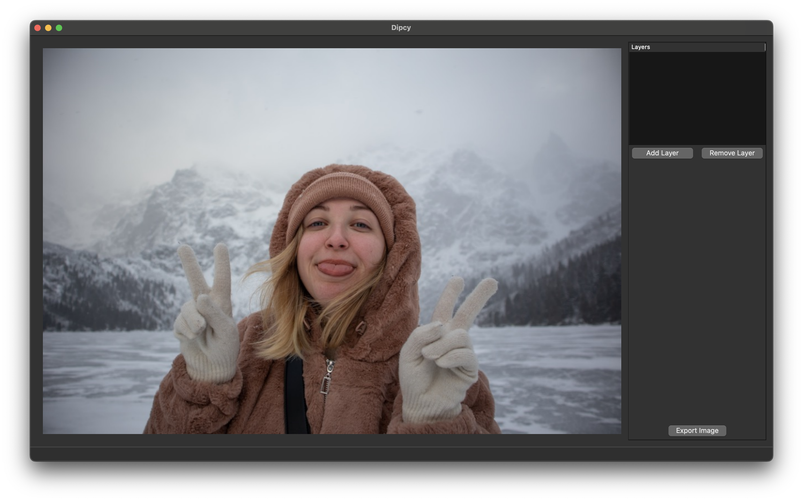

# Dipcy - Dynamic Image Processing Companion

#### Video Demo: https://www.youtube.com/watch?v=mgg_IcDWhCU

#### Description:
Dipcy is a sophisticated image processing application designed for both novice and advanced users to apply various image manipulation techniques effortlessly. Built with a focus on user experience and flexibility, Dipcy allows for real-time adjustments and layer-based editing to enhance and transform images creatively.

## Features

- **Layer-Based Editing**: Implement a non-destructive, layer-based editing approach. Users can add, remove, and reorder layers, each with a specific effect, dynamically updating the image preview to reflect the current layer stack.
- **Dynamic Function Selection**: Dipcy includes a rich set of functions for image editing, such as brightness, contrast, saturation, white balance, and more, offering a wide array of possibilities for image manipulation. Users can select an effect from a dropdown menu in the layer panel and fine-tune its intensity or parameters using sliders, providing a high degree of control over the editing process.
- **Real-Time Image Preview**: Changes are immediately reflected in the main image preview, allowing for quick adjustments and experimentation with different effects.
- **Export Functionality**: Once satisfied with the edits, users can easily export the final image in various formats, preserving the quality and integrity of the work.
- **Customizable UI**: The application boasts a user-friendly interface with resizable panels and a comprehensive view of layers and selected effects, enhancing the editing experience.

## Unique Features

- **Multiple Instances of Editing Functions**: Dipcy allows users to stack the same image editing functions multiple times on different layers. This unique feature enables the creation of complex and nuanced effects that are not achievable with a single application of any given function.

- **Creative Freedom through Function Combination**: By allowing users to combine usual image editing functions in various orders, Dipcy opens up a realm of creativity. The order in which functions are applied significantly alters the final result, providing users with the freedom to experiment and discover unique outcomes.

- **Innovative Use of Negative Function**: The `negative` function, which converts an image to its negative, can be used in conjunction with layer-based editing to alter the usual behavior of other functions. This innovative approach enables users to explore new dimensions of image editing and achieve visually striking effects.

**Screenshots:**

| Before | After |
| ------ | ----- |
|  |  |

## Getting Started

To use Dipcy, simply clone the repository or download the source code. Ensure you have Python installed along with the required libraries: PySide6, OpenCV, NumPy, and SciPy. Run the application from the command line or your preferred Python IDE.

## Contributing

Dipcy is an open-source project, and contributions are welcome. Whether it's adding new features, improving the existing codebase, or reporting bugs, your input helps make Dipcy better for everyone.

## Future Features

Here are some features and improvements I'm planning to add to Dipcy:

- Performance enhance: The plan is to gratly increace performance of image editing and apllying functions. I plan to add gpu aceleration or rewrite program in Cython, or both.
- Advanced Layer Management: Introduce grouping and merging of layers for complex compositions.
- Custom Filters: Implement a feature allowing users to create and save their custom filters as 3DLUT file.
- Batch Processing: Add functionality for editing multiple images at once, applying a set of predefined adjustments.
- AI-Enhanced Editing: Integrating AI-based tools for automatic image normalizateon on batch process.

## Author

Dipcy was developed by [AntonKolomiiets], a passionate software developer and digital artist. For inquiries, contributions, or feedback, feel free to reach out.

- Email: rykerography@gmail.com
- GitHub: [AntonKolomiiets](https://github.com/AntonKolomiiets)
- LinkedIn: [Anton Kolomiiets](https://www.linkedin.com/in/anton-kolomiiets-740322120/)

## License

Dipcy is released under the [MIT License](LICENSE). Feel free to use, modify, and distribute the software as you see fit.

## Acknowledgments

A special thanks to all contributors and the open-source community for their support and contributions to this project.
